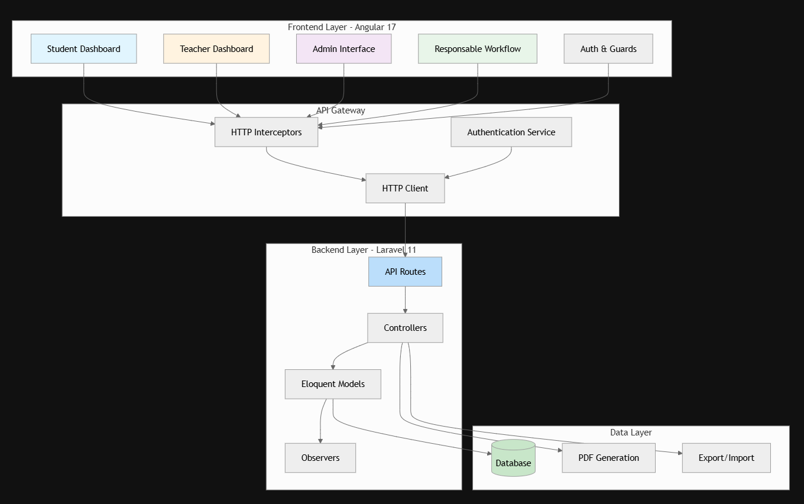

# Overview

GestionStages is a comprehensive internship management platform designed to streamline the entire lifecycle of student internships within educational institutions. The application provides a centralized system for managing internship proposals, student assignments, supervision schedules, report submissions, and administrative workflows. Built on a modern full-stack architecture, it serves multiple user roles including students, teachers, institutional administrators, and departmental supervisors.

# System Purpose
GestionStages addresses the complex coordination challenges in managing student internships by digitizing workflows that traditionally required manual paperwork and disparate communication channels. The platform enables educational institutions to efficiently track internship opportunities from proposal through completion, manage student-teacher-supervisor relationships, handle document generation (conventions and reports), and maintain comprehensive archives for future reference.

The system supports multiple stakeholder workflows: students can browse and apply for internships, submit reports, and track their progress; teachers can propose internships, supervise students, and evaluate reports; responsables (departmental supervisors) manage assignments and oversee organizational requirements; and administrators maintain user accounts, system configuration, and overall data management.

# Technology Stack
The application leverages a modern, production-ready technology stack optimized for performance, maintainability, and developer experience:

| Layer | Technology | Version | Purpose |
|-------|------------|---------|---------|
| Backend Framework | Laravel | 11.0 | PHP framework providing robust MVC architecture, routing, and API capabilities |
| Runtime Language | PHP | 8.2+ | Server-side logic and data processing |
| Frontend Framework | Angular | 17.2.0 | Component-based SPA with standalone components and enhanced performance |
| UI Component Library | PrimeNG | 17.13.0 | Comprehensive suite of 90+ UI components for rapid development |
| State Management | RxJS | 7.8.0 | Reactive programming for data streams and asynchronous operations |
| PDF Generation | laravel-dompdf | 2.2 | Server-side PDF document generation for conventions |
| Data Export/Import | phpspreadsheet | 2.1 | Excel file handling for bulk data operations |
| Calendar Integration | FullCalendar | 6.1.11 | Schedule management for supervision sessions |
| Database ORM | Eloquent | Built-in | Object-relational mapping with composite key support |


# Architecture Overview
The application follows a client-server architecture with clear separation of concerns. The backend exposes a RESTful API that serves as the single source of truth, while the Angular frontend provides a rich, responsive user interface consuming these endpoints. Communication between layers occurs via HTTP/HTTPS, with JSON as the data interchange format.

# Project Structure
The repository follows a monorepo organization with distinct backend and frontend directories, enabling independent development, testing, and deployment while maintaining cohesive version control.

Project Structure
```
gestion-stages/
├── 📁 backend/ (Laravel)
│   ├── app/
│   │   ├── Http/Controllers/
|   |   ├── Models/                  # Eloquent data models
│   │   ├── Observers/               # Model event listeners
│   │   └── Mail/                    # Email templates
│   ├── config/                      # Application configuration
│   ├── database/                    # Migrations and seeders
│   ├── routes/                      # API route definitions
│   └── resources/                   # Blade views for PDF generation
│
├── 📁 frontend/ (Angular)
│   ├── src/
│   │   ├── app/                     # Core application module
│   │   ├── pages/                   # Page components by role
│   │   ├── services/                # HTTP services and guards
│   │   └── assets/                  # Static resources
│   ├── angular.json                 # Angular CLI configuration
│   └── package.json                 # Frontend dependencies
│
└── 📄 Root Configuration Files
    ├── composer.json                # PHP dependencies
    ├── artisan                      # Laravel command-line tool
    └── vite.config.js               # Build tool configuration
```

# Core Domain Model
The system's data model revolves around four primary entities interconnected through well-defined relationships:

- **Stages (Internships):** Central entity representing internship opportunities with attributes including title, dates, status, specialty, and capacity. Stages maintain relationships with organizations (hosting entities) and students (via assignment) app/Models/Stage.php

- **Organismes (Organizations):** External entities hosting internships, storing contact information, organization type, and associated addresses app/Models/Organisme.php

- **Etudiants (Students):** Educational institution members with academic attributes including field of study, level, and student identification, linked to user accounts for authentication app/Models/Etudiant.php

- **PasserStage:** A many-to-many relationship table between students and internships with a composite primary key, additionally tracking evaluation grades for completed internships app/Models/PasserStage.php

The system extends this foundation with supporting entities for reports, keywords, reclamations (complaints), supervision sessions, commissions, and organizational hierarchies.

# User Roles and Permissions
The platform implements a role-based access control system with four distinct user roles, each receiving customized dashboards and functionality:

| Role | Dashboard | Key Capabilities | Route Protection |
|------|-----------|------------------|------------------|
| Student | Student Home | Browse internships, submit applications, deposit reports, view supervision calendar | `authGuard` with student role |
| Teacher (Enseignant) | Teacher Dashboard | Propose internships, manage supervision sessions, review reports, handle reclamations | `authGuard` with teacher role |
| Responsable | Responsable Workspace | Assign students to internships, manage organizations, review commissions, archive reports | `authGuard` with resp role |
| Administrator | Admin Panel | Create/manage user accounts, system configuration, data management, parameter tuning | `authGuard` with admin role |

# Key Features
GestionStages provides a comprehensive feature set addressing the complete internship lifecycle:

## Core Workflows
- **Internship Lifecycle Management:** Full lifecycle support from teacher proposal through student application, administrative approval, assignment, execution, and final evaluation. Automatic status updates via observers ensure data consistency app/Observers/StageObserver.php

- **Student Assignment System:** Flexible assignment workflows allowing responsables to match students with appropriate internships based on specialization, academic level, and capacity constraints, with support for bulk assignments app/Models/PasserStage.php

- **Supervision & Calendar Management:** Integrated FullCalendar implementation enabling teachers to schedule and track supervision sessions, with students viewing their assigned sessions and receiving notifications frontend/package.json

- **Report & Keyword System:** Structured report submission workflow with keyword tagging for enhanced searchability and categorization, supporting PDF uploads and academic metadata tracking app/Models/Rapport.php

## Administrative Features
- **Document Generation:** Automated PDF generation for internship conventions (contracts) and summary fiches using laravel-dompdf with Blade templating composer.json

- **Data Export/Import:** Bulk operations enabling administrators to export student, internship, or organization data to Excel formats and import updates using phpSpreadsheet composer.json

- **Search Functionality:** Advanced search capabilities across students, responsables, and other entities with filtering by multiple attributes (specialty, academic year, etc.) routes/api.php

- **Reclamation Handling:** Structured workflow for students to submit issues or complaints, with tracking and resolution management through appropriate administrative channels

# Development Approach
The project follows modern development practices emphasizing code quality, maintainability, and developer productivity:

- Model-View-Controller Pattern: Laravel's MVC architecture separates business logic (Models), request handling (Controllers), and presentation (Blade views for PDF generation) app/Http/Controllers

- Component-Based Architecture: Angular's component system promotes reusability with isolated logic, styling, and templates, organized by feature and user role frontend/src/pages

- Reactive Programming: RxJS integration enables declarative data streams and asynchronous operation handling, improving code readability and debugging capabilities

- Service-Oriented Design: Angular services encapsulate HTTP communication, authentication logic, and cross-cutting concerns like loading states and interceptors frontend/src/services

- Observer Pattern: Laravel observers automatically handle side effects when models change, such as updating internship status based on date comparisons app/Observers/StageObserver.php

> 💡 The composite key implementation in PasserStage using thiagoprz/eloquent-composite-key package enables proper many-to-many relationships with custom primary keys, essential for tracking student-internship assignments with additional attributes like grades.

# Next Steps
To get started with GestionStages, continue your journey through the documentation:

- [Quick Start](quick-start.md) - Learn how to set up the development environment and run the application locally
- [System Architecture](backend/README.md) - Dive deeper into the architectural patterns and design decisions
- [Backend Installation](backend-installation.md) - Detailed guide for setting up the Laravel backend
- [Frontend Installation](frontend-installation.md) - Complete instructions for configuring the Angular frontend


## 📄 License
MIT License
